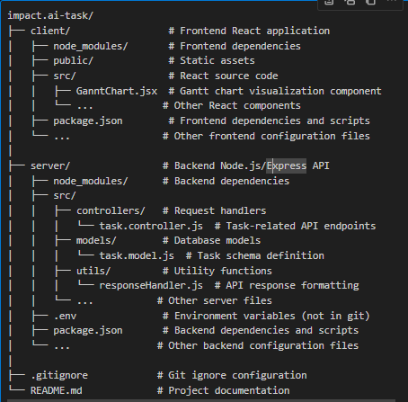

# Impact.AI Task Management System

A full-stack task management application with dependency tracking and Gantt chart visualization. This system allows users to create tasks with dependencies and visualize project timelines through an interactive Gantt chart.

## Project Description

This application provides a solution for project planning and management by enabling users to:

- Create tasks with specific durations
- Define dependencies between tasks
- Automatically calculate task start times based on dependencies
- Visualize project timeline using a Gantt chart
- Calculate total project duration

The system ensures tasks with dependencies only start after all their prerequisite tasks are completed, providing accurate project timelines.

## Folder Structure


## Setup Instructions

### Prerequisites

- Node.js (v14 or higher)
- MongoDB (local or Atlas)
- npm or yarn

### Server Setup

1. Navigate to the server directory:
   ```bash
   cd server
2. Install dependencies:
    ```bash
    npm install
3. Create a .env file with the following variables:
    ```bash
    PORT=5050
    MONGODB_URI=your_mongodb_connection_string
4. Start the server:
    ```bash
    npm start
    

### client Setup
1. Navigate to the client directory:
    cd client
2. Install dependencies:
    npm install
3. Start the React development server:
    npm start
4. Open your browser and navigate to http://localhost:3000

Features
Task Management
Create tasks with name and duration
Set task dependencies
View all tasks
Gantt Chart Visualization
Interactive timeline view of all tasks
Color-coded task bars
Task duration display
Automatic positioning based on dependencies
Project Analysis
Calculate total project duration
Identify critical path tasks

POST /api/tasks
Create a new task.

GET /api/tasks
Retrieve all tasks with project duration.

Technologies Used
Frontend
React.js
Axios for API requests
Tailwind CSS for styling
Backend
Node.js
Express.js
MongoDB with Mongoose ODM